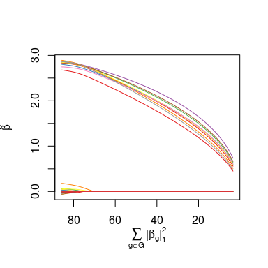

<!--  -*- coding: utf-8 -*- -->

<!-- README.md is generated from README.Rmd. Do not edit this file directly -->

[](https://github.com/DataSlingers/ExclusiveLasso/actions?query=workflow%3A%22R-CMD-check+and+Deploy%22)
[](https://codecov.io/gh/DataSlingers/ExclusiveLasso)
[](https://www.gnu.org/licenses/old-licenses/gpl-2.0.en.html)
[](https://cran.r-project.org/package=ExclusiveLasso)
[](https://www.repostatus.org/#active)

## The Exclusive Lasso

This package implements the `ExclusiveLasso` penalty of Zhou, Jin, and
Hoi (2010) and Campbell and Allen (2017) for generalized linear models.

\[\text{arg min}_{\beta} \frac{1}{2n} \|y - X\beta\|_2^2 + \lambda \sum_{g \in \mathcal{G}} \frac{\|\beta_g\|_1^2}{2}\]

This penalty is the “converse” of the group lasso, encouraging selection
of a single variable in each group. See Campbell and Allen (2017) for a
thorough discussion of this estimator and its properties.

The package provides efficient inexact proximal gradient and coordinate
descent schemes to solve exclusive lasso problems. The interface is
similar to that of the popular
[`glmnet`](https://cran.r-project.org/web/packages/glmnet/index.html),
[`ncvreg`](http://pbreheny.github.io/ncvreg/), and
[`grpreg`](http://pbreheny.github.io/ncvreg/) packages.

## Installation

The current working version of the package can be installed from Github:

``` r
library(devtools)
install_github("DataSlingers/ExclusiveLasso")
```

## Usage

We begin by simulating a small data set with simple structure:

``` r
library(ExclusiveLasso)
n <- 200
p <- 500
groups <- rep(1:10, times=50)
beta <- numeric(p);
beta[1:10] <- 3

X <- matrix(rnorm(n * p), ncol=p)
y <- X %*% beta + rnorm(n)
```

We fit the exclusive lasso to this data set, using a user-specified
group structure:

``` r
exfit <- exclusive_lasso(X, y, groups)
print(exfit)
#> Exclusive Lasso Fit 
#> ------------------- 
#> 
#> N: 200. P: 500.
#> 10 groups. Median size 50 
#> 
#> Grid: 100 values of lambda. 
#>   Miniumum: 0.04212819 
#>   Maximum:  4.212819 
#>   Degrees of freedom:  1.941015  -->  39.28066 
#>   Number of selected variables: 10  -->  41 
#> 
#> Fit Options:
#>   - Family:         Gaussian 
#>   - Intercept:      TRUE 
#>   - Standardize X:  TRUE 
#>   - Algorithm:      Coordinate Descent 
#> 
#> Time:  0.162 secs
plot(exfit)
```

<!-- -->

As we can see, for this very simple problem, the exclusive lasso picked
out the true variables (though the standard lasso would have done as
well here).

The `cv.exclusive_lasso` function can be used to select the tuning
parameter \(\lambda\), though as Campbell and Allen (2017) note,
standard cross-validation does not perform particularly well for this
problem, and model selection according to BIC / EBIC with a
group-thresholding step yields superior results. To facilitate model
selection by BIC / EBIC, an unbiased estimate of the degrees of freedom
is calculated.

In addition to standard linear regression, the `ExclusiveLasso` package
also implements logistic and Poisson regression. See the package
vignette for details.

## Authors

  - [Michael Weylandt](http://github.com/michaelweylandt)
    
    Department of Statistics, Rice University

  - [Frederick Campbell](http://fc10.web.rice.edu/index.html)
    
    Department of Statistics, Rice University

  - [Genevera Allen](http://www.stat.rice.edu/~gallen)
    
    Departments of Statistics, CS,and ECE, Rice University
    
    Jan and Dan Duncan Neurological Research Institute Baylor College of
    Medicine and Texas Children’s Hospital

## Acknowledgements

  - MW was supported by NSF Graduate Research Fellowship No.1450681.

  - FC was supported by NSF Graduate Research Fellowship No.0940902.

  - GA acknowledges funding from NSF/DMS-1264058 and NSF/DMS-1209017.

## References

Campbell, Frederick, and Genevera I. Allen. 2017. “Within-Group Variable
Selection Through the Exclusive Lasso.” *Electronic Journal of
Statistics* **11**(2): 4220–4257.
[doi:10.1214/17-EJS1317](http://dx.doi.org/10.1214/17-EJS1317).

Zhou, Yang, Rong Jin, and Steven C.H. Hoi. 2010. “Exclusive Lasso for
Multi-Task Feature Selection.” In *AISTATS 2010: Proceedings of the
Thirteenth International Conference on Artificial Intelligence and
Statistics*, edited by Yee Whye Teh and Mike Titterington. JMLR.
<http://proceedings.mlr.press/v9/zhou10a.html>.
